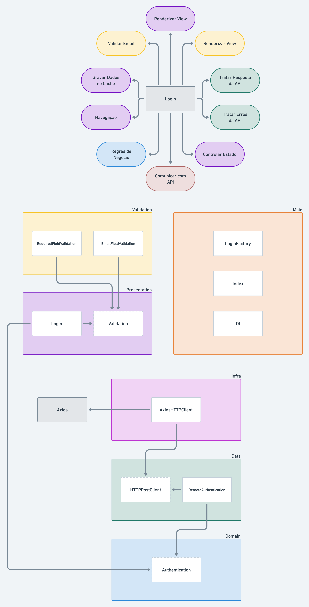

### ReactJS, Hooks, Recoil, TDD, Clean Architecture, SOLID - Rodrigo Manguinho

ReactJS com Typescript e Hooks, TDD, Clean Architecture e Design Patterns.

    
    

---

#### Telas do Sistema

    

---

#### Descrição

Curso do Rodrigo Manguinho sobre ReactJS com Typescript e Hooks aplicando Clean Architecture, TDD (Jest, React Testing Library, Cypress) e Design Patterns (SOLID, DRY, KISS e YAGNI).

---

#### Visualizar o projeto na IDE:

Para quem quiser visualizar o projeto na IDE clique no teclado a tecla `ponto`, esse recurso do GitHub é bem bacana
